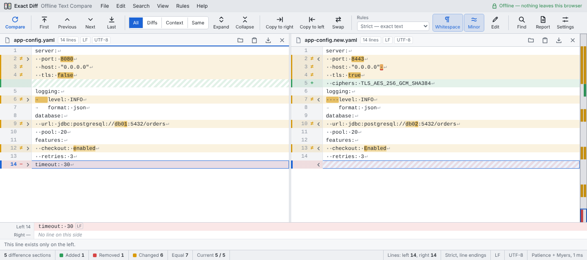

<div align="center">


# Exact Diff

**Character-exact, side-by-side text comparison that runs entirely offline.**
One HTML file. No install, no server, no network access — every space, tab and line ending counts.

[](https://github.com/YOUR-USERNAME/exact-diff/actions/workflows/ci.yml)
[](https://github.com/YOUR-USERNAME/exact-diff/actions/workflows/codeql.yml)
[](https://github.com/YOUR-USERNAME/exact-diff/releases/latest)
[](LICENSE)

[**Open the web app**](https://YOUR-USERNAME.github.io/exact-diff/) ·
[**Download**](https://github.com/YOUR-USERNAME/exact-diff/releases/latest) ·
[How it works](#how-it-works) ·
[Development](#development)



</div>

## Why

Most diff tools quietly normalise text. That hides exactly the differences that break things in
production: a trailing space in a YAML value, tabs instead of spaces, a CRLF line ending in a shell
script, a no-break space pasted from a document, a missing final newline. Exact Diff shows all of
them, character by character, and explains each one.

It is also built for places where you cannot paste text into a website: it makes **no network
requests at all** (enforced by a Content-Security-Policy), keeps nothing, and works from a single
file on an air-gapped machine.

## Features

**Comparison**
- Strict mode by default: spaces, tabs, case, punctuation, Unicode, blank lines and CR / LF / CRLF all count
- Line, word and character-level highlighting, aligned side by side with filler rows
- Rules: ignore whitespace, case, blank lines, line endings, or any text matching a regular expression (timestamps, IDs)
- Unimportant differences (≈) shown separately and not counted
- Three algorithms: Patience + Myers (default), Myers O(ND), line-by-line by position

**Working with differences**
- Next / previous / first / last difference (F7, F8, Ctrl+F7, Ctrl+F8) and a clickable overview map
- Show all lines, differences only, differences with context, or identical lines only
- Copy a section left or right with one click; copy all; swap sides; full undo / redo
- Line details pane: names the exact first differing character, e.g. *“column 18: U+0030 on the left, U+0035 on the right”*
- Find and replace with match case, whole word and regular expressions
- Edit text in place with live highlighting

**Files**
- Open, drag and drop, or paste; UTF-8, UTF-8 BOM, UTF-16 LE/BE and Windows-1252 detected
- Save writes back the original encoding and every original line ending
- Export a standalone HTML report or copy a plain-text summary
- Handles 100,000+ lines (diffing runs in a background worker)

**Interface**
- Light and dark themes, side-by-side or stacked layout, resizable panes, word wrap
- Menus, toolbar, right-click menu and keyboard shortcuts

## Get it

| Option | Size | Runs on | Install |
|---|---|---|---|
| **[Web app](https://YOUR-USERNAME.github.io/exact-diff/)** | ~90 KB transferred | Any modern browser | None. Use *Install app* in Chrome or Edge for a desktop window that works offline. |
| **Single file** `exact-diff-vX.Y.Z.html` | ~175 KB (~50 KB zipped) | Windows, macOS, Linux, ChromeOS | None. Download and double-click; works with no internet. |
| Windows `…-setup.exe` / `…-portable.exe` | ~90 MB | Windows 10/11 x64 | Per-user installer, or a single portable file |
| Linux `.AppImage` / `.deb` | ~95 MB | x64 Linux | `sudo apt install ./exact-diff-*.deb` (recommended on Ubuntu 24.04+) |
| macOS `.dmg` | ~100 MB | Intel and Apple silicon | Drag to Applications |

All downloads are on the [releases page](https://github.com/YOUR-USERNAME/exact-diff/releases/latest).
The desktop builds wrap the same HTML file in [Electron](https://www.electronjs.org/), which
bundles a browser engine; that is why they are large. If size matters, use the single file or the web app.

> The desktop builds are not code-signed. Windows SmartScreen shows *“unknown publisher”*
> (choose *More info → Run anyway*). On macOS, right-click the app and choose *Open* the first time.

### Verify a download

Every release file has a SHA-256 checksum in `SHA256SUMS.txt` and a signed
[build provenance attestation](https://docs.github.com/en/actions/security-for-github-actions/using-artifact-attestations)
proving it was built by this repository's release workflow:

```bash
sha256sum -c SHA256SUMS.txt --ignore-missing
gh attestation verify exact-diff-v1.0.0.html --repo YOUR-USERNAME/exact-diff
```

## Usage

1. Open or drop a file on each side (or paste with **Ctrl+V**). The comparison runs automatically.
2. Press **F8** / **F7** to move between differences. Click a line to see it character by character in the line details pane.
3. Use **Rules** to ignore whitespace, case, blank lines, line endings or a pattern.
4. Copy sections across with the arrows in the gutter, then **Save**, or **Export report**.

Desktop builds also accept two files on the command line: `exact-diff old.yaml new.yaml`.

| Shortcut | Action |
|---|---|
| Ctrl+Enter | Compare |
| F8 / F7 | Next / previous difference |
| Ctrl+F8 / Ctrl+F7 | Last / first difference |
| ↑ ↓ / Enter | Move the selected line / edit it |
| Ctrl+F / Ctrl+H | Find / replace |
| Ctrl+Z / Ctrl+Y | Undo / redo |
| Ctrl+Shift+S | Swap sides |

## Privacy and security

- **No network access.** The page's Content-Security-Policy sets `default-src 'none'` and
  `connect-src 'none'`, so the browser itself refuses any request. The test suite checks that none are made.
- **Nothing is stored** except your settings (theme, rules) in `localStorage`. Compared text never leaves memory.
- **Compared text is never executed.** All text is HTML-escaped before rendering; `<script>` in a file is shown as text.
- **Invisible characters are exposed.** Zero-width, control and bidirectional-override characters (as used in
  [“Trojan Source”](https://trojansource.codes/) attacks) are shown as labelled badges.
- **Desktop hardening.** Electron runs with context isolation, sandbox and no Node.js integration; the main
  process cancels all network requests and blocks navigation.
- **Supply chain.** GitHub Actions are pinned to commit SHAs and updated by Dependabot; CodeQL scans the
  code and workflows; releases carry SLSA build provenance.

See [SECURITY.md](SECURITY.md) to report a vulnerability.

## How it works

```
src/index.html  ── the whole app: HTML + CSS + vanilla JavaScript, no dependencies
   │
   ├─ scripts/build-web.mjs ─┬─ dist/exact-diff.html   single file (byte-identical copy)
   │                         └─ dist/web/              + manifest, icons, service worker (PWA)
   └─ desktop/ (Electron) ───── Windows, Linux and macOS packages
```

1. **Text model.** Each side is split into lines while keeping every line's exact terminator (`\r\n`, `\n`, `\r`
   or none), so line endings and a missing final newline can be compared and saved back unchanged.
   Browsers' `<textarea>` converts all line breaks to LF, so the editor syncs edits back into this model
   instead of trusting the textarea.
2. **Line matching.** Lines are hashed to integers under the active rules, then matched with
   **Patience diff** (anchor on lines that occur once on each side, take the longest increasing chain,
   recurse) and **Myers' O(ND) algorithm** for the gaps. A bounded edit distance keeps pathological input
   from freezing the page; such regions are reported as whole-block replacements.
3. **Line pairing.** Inside each changed block, lines are paired by a dynamic-programming alignment over
   Sørensen–Dice similarity of character bigrams, so a changed line sits next to its counterpart and true
   insertions stay insertions.
4. **Intra-line diff.** Changed lines get a word-level Myers diff; similar word runs are refined to
   characters (by code point, so emoji and combining marks are never split).
5. **Rendering.** Rows are virtualised (only visible rows are in the DOM) with variable heights for word
   wrap, which keeps 100,000-line files responsive.

**References**

- E. W. Myers, “An O(ND) difference algorithm and its variations”, *Algorithmica* 1(1–4):251–266, 1986. [doi:10.1007/BF01840446](https://doi.org/10.1007/BF01840446) (peer-reviewed)
- L. R. Dice, “Measures of the amount of ecologic association between species”, *Ecology* 26(3):297–302, 1945. [doi:10.2307/1932409](https://doi.org/10.2307/1932409) (peer-reviewed)
- Patience diff was described by Bram Cohen in Bazaar's documentation and blog posts; no peer-reviewed source exists.

## Development

Requires [Node.js](https://nodejs.org/) 22.12 or newer (see `.nvmrc`).

```bash
git clone https://github.com/YOUR-USERNAME/exact-diff.git
cd exact-diff
npm ci
npx playwright install chromium     # browsers for the end-to-end tests
npm test                            # unit tests + end-to-end tests
npm run build                       # → dist/exact-diff.html and dist/web/
npm run serve                       # preview the web app at http://localhost:4173
```

The app has no runtime dependencies. You can also just open `src/index.html` in a browser and edit it.

| Command | What it does |
|---|---|
| `npm run test:unit` | Diff-engine tests (including a 9,000-case fuzz test) and build checks, with Node's built-in test runner |
| `npm run test:e2e` | Builds, then runs Playwright tests (Chromium, Firefox, WebKit in CI) |
| `npx playwright test --project=chromium` | End-to-end tests in one browser |
| `cd desktop && npm ci && npm start` | Run the desktop app |
| `cd desktop && npm run dist:linux` | Build desktop packages (`dist:win`, `dist:mac` on those systems) |

### Project structure

```
├── src/index.html            the application (single source of truth)
├── web/                      PWA manifest, service worker template, icons
├── desktop/                  Electron wrapper (main.js, preload.js, packaging config)
├── scripts/                  build, local server, version sync (Node built-ins only)
├── tests/unit/               node:test unit tests
├── tests/e2e/                Playwright end-to-end tests
├── docs/                     screenshots and the publishing guide
└── .github/                  CI, Pages deploy, release, CodeQL, Dependabot, templates
```

### Releasing

```bash
npm version minor            # bumps every version file, commits and tags vX.Y.0
git push --follow-tags       # the Release workflow builds, signs provenance and publishes
```

See [docs/PUBLISHING.md](docs/PUBLISHING.md) for the full first-time setup.

## Limitations

- Search and replace work line by line; a pattern cannot span lines.
- Editing happens in a separate *Edit* view rather than directly in the aligned view.
- Saving to the original file in place needs Chrome or Edge (File System Access API); other browsers download the file.
- Windows-1252 files are saved as UTF-8 (browsers cannot encode Windows-1252).
- The macOS packages are built by CI but are unsigned; Apple silicon may need `xattr -cr "/Applications/Exact Diff.app"` before the first launch.

## Contributing

Issues and pull requests are welcome; see [CONTRIBUTING.md](CONTRIBUTING.md).

## License

[MIT](LICENSE) © 2026 Omkar Gupta
